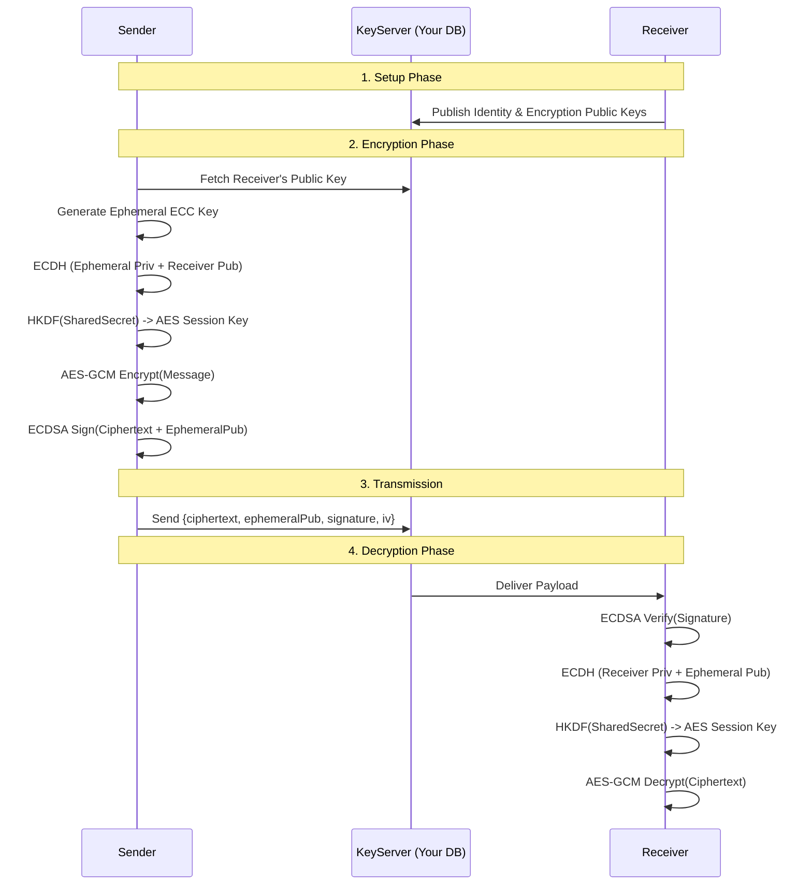

# EvoE2EE SDK (End-to-End Encryption)


Production-grade End-to-End Encryption (E2EE) SDK for **React**, **Node.js**, and **Vanilla JS**. Built on top of **ECDH (P-256)**, **AES-256-GCM**, and **HKDF**.

> [!IMPORTANT]
> This SDK implements a "Signal-Style" double-ratchet inspired flow, ensuring that even if your server is compromised, the messages remain undecipherable.

---

## 🏗 System Architecture


### The Encryption Lifecycle



---

## 🚀 Quick Start Guide

### 1. Installation
```bash
npm install evo-e2ee
```

### 2. Initialization
Initialize the SDK once at the start of your application. It automatically chooses the best crypto provider (Node WebCrypto or Browser SubtleCrypto).

```typescript
import { evoE2EE } from "evo-e2ee";

await evoE2EE.init({
  appId: "my-secure-app",
  platform: "react" // or 'node' | 'browser'
});
```

### 3. Key Management
The SDK manages two types of keys for every user:
1. **Identity Key**: Long-term key used for signing (Authenticity).
2. **Encryption Key**: Used for ECDH shared secret derivation.

```typescript
const { identityKey, encryptionKey } = evoE2EE.getPublicKeys();
// Store these on your server so others can find you!
```

---

## 🔐 Developer Manual

### Sending a Secure Message
To send a message, you need the recipient's **Encryption Public Key**.

```typescript
const encryptedPayload = await evoE2EE.encrypt(
  "Secret Message", 
  "RECIPIENT_ENCRYPTION_PUBLIC_KEY_BASE64"
);

// encryptedPayload contains:
// { cipherText, ephemeralPublicKey, signature, iv, version }
```

### Receiving a Secure Message
When you receive a payload, you can decrypt it. If you know the sender, pass their **Identity Public Key** to verify their identity.

```typescript
try {
  const plainText = await evoE2EE.decrypt(
    encryptedPayload,
    "SENDER_IDENTITY_PUBLIC_KEY_BASE64"
  );
  console.log("Decrypted:", plainText);
} catch (err) {
  console.error("Decryption failed or Signature invalid!");
}
```

---

## 🛠 Production Safeguards

| Feature | Protection | Description |
| :--- | :--- | :--- |
| **P-256 ECC** | Identity | Future-proof elliptic curve cryptography. |
| **AES-256-GCM** | Privacy | Military-grade encryption with built-in integrity tagging. |
| **Ephemeral Keys** | Key Binding | A new ephemeral key is generated for every single message. |
| **Signature Binding** | No-Tampering | The signature covers both the text and the keys, preventing man-in-the-middle key swaps. |
| **HKDF** | Key Isolation | Shared secrets are never used directly; they are derived through HKDF. |

---

## 📜 License
MIT License. Created by **Daksha Dubey**.
